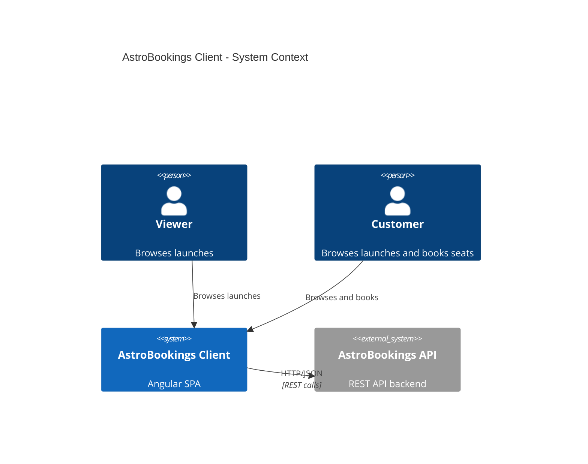

# AstroBookings Client Architectural Design Document

Angular SPA that consumes the AstroBookings REST API to let users browse rocket launches and book seats.

### Table of Contents

- [Stack and Tooling](#stack-and-tooling)
- [Systems Architecture](#systems-architecture)
- [Software Architecture](#software-architecture)
- [Architecture Decisions Record](#architecture-decisions-record-adr)

## Stack and Tooling

### Technology Stack

| Layer | Technology | Version |
|-------|-----------|---------|
| Language | TypeScript | 5.9 |
| Framework | Angular | 21 |
| Styling | SCSS (BEM) | - |
| State Management | Angular Signals | built-in |
| HTTP | Angular HttpClient | built-in |
| Routing | Angular Router | built-in |
| SSR | @angular/ssr + Express | 5.x |
| Unit Testing | Vitest | 4.x |
| Package Manager | npm | 10.x |

### Development Tools

| Tool | Purpose |
|------|---------|
| Angular CLI (`ng`) | Scaffold, serve, build, test |
| Prettier | Code formatting (100 printWidth, single quotes) |
| Vitest | Unit test runner via `@angular/build:unit-test` |
| Git | Version control (branch: `main`) |

**Workflow:**

```bash
npm start          # Dev server at http://localhost:4200
npm run build      # Production build to dist/
npm test           # Unit tests with Vitest
```

## Systems Architecture

The system follows a simple client-server architecture. The Angular SPA runs in the browser and communicates with the AstroBookings REST API over HTTP.



## Software Architecture

The application uses a **feature-first** folder structure with lazy-loaded routes. Each feature encapsulates its own components and services. Shared UI components live in a `shared/` directory. Core models and API configuration live in `core/`.

### Folder Structure

```text
src/app/
  app.ts                          # Root component (shell + router-outlet)
  app.routes.ts                   # Top-level routes with lazy loading
  app.config.ts                   # Application providers (router, http, hydration)
  core/
    models/
      launch.interface.ts         # Launch, Rocket interfaces
      booking.interface.ts        # Booking, CreateBookingDto interfaces
    api.config.ts                 # API base URL from environment
  shared/
    components/
      loading/                    # Loading spinner component
      error-message/              # Error display component
      empty-state/                # Empty state component
  features/
    launches/
      launches.routes.ts          # Feature routes (list + detail)
      launch-list/                # Launch list page component
      launch-detail/              # Launch detail page component
      launches.service.ts         # HTTP service for launches
    bookings/
      bookings.routes.ts          # Feature routes (list + create)
      booking-list/               # Booking list page component
      booking-form/               # Booking creation form component
      bookings.service.ts         # HTTP service for bookings
```

### Data Flow

```
API  -->  Service (HttpClient + signals)  -->  Component (reads signals)  -->  Template (@if/@for)
```

1. **Service** calls the API via `HttpClient`, stores results in signals (`data`, `loading`, `error`).
2. **Component** injects the service, reads its signals in the template.
3. **Template** uses `@if` / `@for` to render loading, error, empty, or data states.

### Domain Models

```typescript
interface Launch {
  id: string;
  agencyId: string;
  rocketId: string;
  date: string;
  mission: string;
  destination: string;
  pricePerSeat: number;
  totalSeats: number;
  availableSeats: number;
  status: string;
  rocket: Rocket;
}

interface Rocket {
  id: string;
  name: string;
  capacity: number;
  range: string;
}

interface Booking {
  id: string;
  launchId: string;
  travelerId: string;
  numberOfSeats: number;
  totalPrice: number;
  status: string;
}

interface CreateBookingDto {
  launchId: string;
  travelerId: string;
  numberOfSeats: number;
}
```

### Routing

| Path | Feature | Component | Load |
|------|---------|-----------|------|
| `/` | - | Redirect to `/launches` | - |
| `/launches` | launches | LaunchListComponent | Lazy |
| `/launches/:id` | launches | LaunchDetailComponent | Lazy |
| `/bookings/:travelerId` | bookings | BookingListComponent | Lazy |

### Service Pattern

Each feature service follows this pattern:

- `@Injectable({ providedIn: 'root' })`
- Exposes three signals: `data`, `loading`, `error`
- Uses `HttpClient` with `catchError` for all API calls
- API base URL read from centralized config

### API Mapping

| PRD Requirement | Endpoint (expected) | Service Method |
|-----------------|-------------------|----------------|
| FR1: View launches | `GET /api/launches` | `LaunchesService.getAll()` |
| FR2: View launch detail | `GET /api/launches/:id` | `LaunchesService.getById(id)` |
| FR3: Book seats | `POST /api/bookings` | `BookingsService.create(dto)` |
| FR4: View bookings | `GET /api/bookings?travelerId=:id` | `BookingsService.getByTraveler(id)` |

## Architecture Decisions Record (ADR)

### ADR 1: Standalone components only
- **Decision**: Use Angular standalone components exclusively. No NgModules.
- **Status**: Accepted
- **Context**: Angular 21 fully supports standalone components. NgModules add unnecessary boilerplate for a small application.
- **Consequences**: Every component, directive, and pipe must set `standalone: true` and declare its own imports.

### ADR 2: Angular Signals for state management
- **Decision**: Use Angular Signals (`signal()`, `computed()`, `toSignal()`) for all reactive state. No NgRx, no BehaviorSubject.
- **Status**: Accepted
- **Context**: The app has simple state needs (API data + loading/error). Signals are built-in, lightweight, and align with Angular's direction.
- **Consequences**: Services expose signals directly. Components read signals in templates with automatic change detection via `OnPush`.

### ADR 3: Lazy-loaded feature routes
- **Decision**: Each feature (`launches`, `bookings`) is lazy-loaded via `loadChildren` in the router.
- **Status**: Accepted
- **Context**: Lazy loading keeps the initial bundle small and enforces clear feature boundaries.
- **Consequences**: Each feature has its own routes file. Components are only loaded when the user navigates to that feature.

### ADR 4: Environment-based API configuration
- **Decision**: The API base URL is configured via a centralized `api.config.ts` reading from Angular environments.
- **Status**: Accepted
- **Context**: The API URL differs between development and production. Centralizing it avoids hardcoded URLs scattered across services.
- **Consequences**: All services import the API base URL from a single source.

### ADR 5: BEM + SCSS with CSS variables
- **Decision**: Use BEM naming convention with SCSS and CSS custom properties for theming.
- **Status**: Accepted
- **Context**: BEM provides predictable class naming. CSS variables enable easy theming without a CSS-in-JS library.
- **Consequences**: No hardcoded colors in component styles. Max 3 levels of SCSS nesting. Mobile-first with `min-width` breakpoints.
